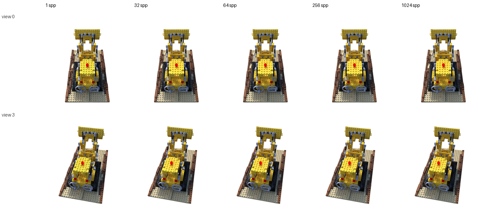
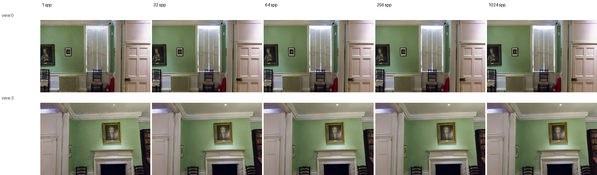
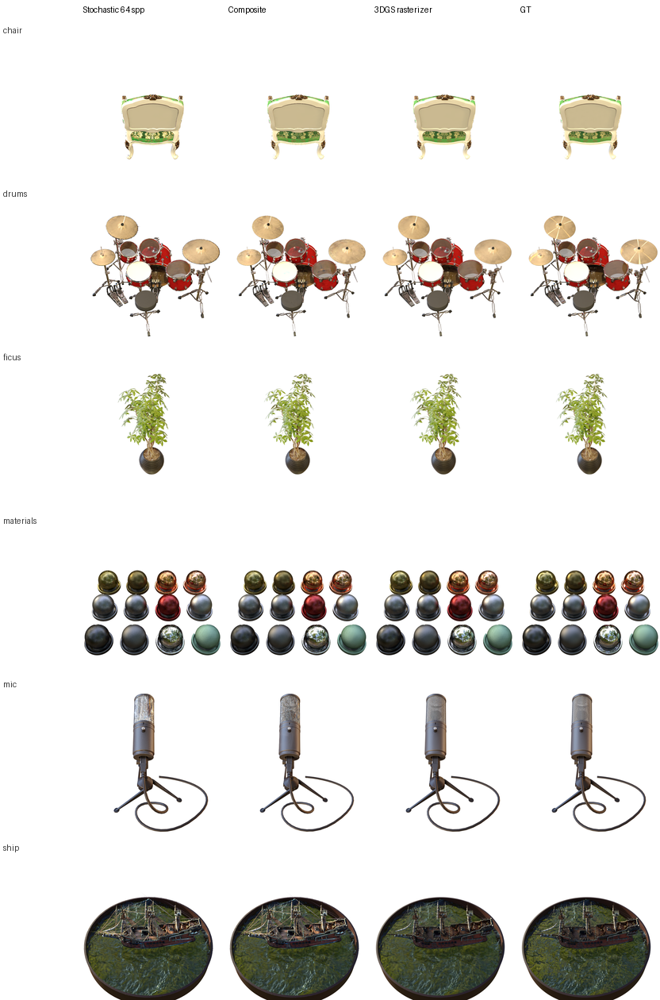
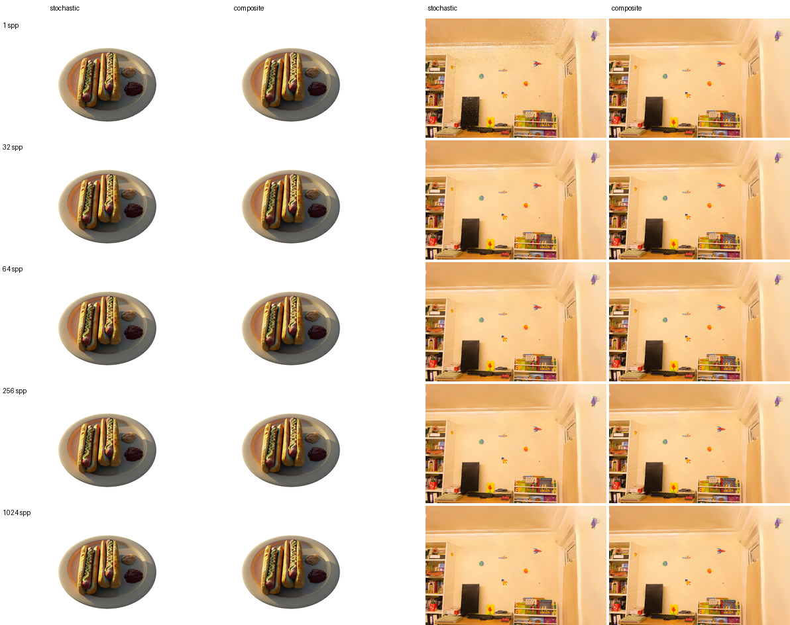

# Final Project — Stochastic 3D Gaussian Ray Tracing in PBRT v4

CPU implementation of [*Stochastic Ray Tracing of Transparent 3D Gaussians*](https://arxiv.org/abs/2504.06598) (Sun, Georgiev, Fei, Hašan; EGSR 2025) in **PBRT v4**: load trained 3DGS `point_cloud.ply`, stochastically intersect Gaussians along rays, shade with spherical harmonics, and compare against an exact composite reference and the 3DGS rasterizer.

All benchmarks and figures in this repo use the **CPU** path integrator only.

---

## Core results

**SPP convergence (NeRF Synthetic — lego)**



**SPP convergence (Tanks & Temples — drjohnson)**



**Method comparison across six NeRF Synthetic scenes (64 spp)**



**Stochastic vs. composite on hotdog & playroom**



| Metric | Result |
|--------|--------|
| Stochastic vs. composite PSNR | ~47–55 dB at 1024 spp (12 scenes) |
| Speedup vs. composite | 5.7–20.4× at 64 spp |
| SPP scaling | ~3 dB PSNR per 4× samples |
| vs. rasterizer | 1–9 dB gap on typical scenes |

Numbers: [`report_results/benchmark_summary.json`](report_results/benchmark_summary.json).

---

## What is implemented

| Feature | Location |
|---------|----------|
| Binary 3DGS PLY loader (SH degree 3) | `pbrt-v4/src/pbrt/util/plyloader_3dgs.cpp` |
| Stochastic intersection (TrigHash) | `pbrt-v4/src/pbrt/gaussian.cpp` |
| Exact composite reference | `IntersectComposite` |
| BVH / Kd-tree + `t_max` clipping | `IntersectBVH`, `IntersectKdTree` |
| OursMean / OursCenter depth | `use_center_depth` |
| N-sample single traversal | `multi_samples` |
| 2D tile grid (NeRF Synthetic) | `use_2d_alpha` + camera params |

Scenes are generated automatically from per-scene `cameras.json` via `scripts/benchmark_assets.py`.

---

## Environment setup

### A. 3DGS training (`gaussian-splatting/`)

Use the **Inria 3DGS** codebase bundled in this repo. Follow their setup:

- [`gaussian-splatting/README.md`](gaussian-splatting/README.md)
- [`gaussian-splatting/environment.yml`](gaussian-splatting/environment.yml) — Conda env with PyTorch, CUDA, `diff-gaussian-rasterization`, etc.

Helper scripts for our datasets: `run_nerf_synthetic.sh`, `run_tandt_db.sh`.

After training, copy outputs into the PBRT asset layout (step B).

### B. PBRT renderer + report pipeline (`pbrt-v4/`)

**C++ build** — same requirements as stock PBRT v4 (Visual Studio 2022, CMake ≥ 3.20). Build **CPU only**:

```powershell
cd Final/pbrt-v4
cmake -B build -DPBRT_OPTIX_PATH=""
cmake --build build --config Release --target pbrt_exe
```

Compiler, dependencies, and scene format details: [PBRT v4 documentation](https://pbrt.org/) and `pbrt-v4/README.md`.

**Extra Python packages** (beyond a minimal PBRT install) for benchmarks and figures:

```powershell
pip install numpy pillow OpenEXR Imath scikit-image python-docx plyfile
# optional, for LPIPS in benchmark metrics:
pip install torch lpips
```

| Package | Used by |
|---------|---------|
| `numpy`, `Pillow`, `OpenEXR`, `Imath` | `report_benchmark_pipeline.py`, `exr_to_png.py` |
| `scikit-image` | SSIM in benchmarks |
| `python-docx` | `update_report_from_results.py`, `insert_methods_comparison_docx.py` |
| `plyfile` | `make_ply_previews.py` |
| `torch`, `lpips` | LPIPS only (optional; skipped if missing) |

---

## Assets

Git tracks **metadata** under `pbrt-v4/scenes/assets/` (`cameras.json`, metrics JSON). Large files stay **local**:

```
pbrt-v4/scenes/assets/3dgs/<scene>/point_cloud/iteration_30000/point_cloud.ply
pbrt-v4/scenes/assets/tandt_db/<scene>/point_cloud/iteration_30000/point_cloud.ply
pbrt-v4/scenes/assets/<dataset>/<scene>/test/ours_30000/   # GT + rasterizer PNGs
```

**Scenes:** `chair`, `drums`, `ficus`, `hotdog`, `lego`, `materials`, `mic`, `ship` (3dgs) · `drjohnson`, `playroom`, `train`, `truck` (tandt_db).

Copy from `gaussian-splatting/output/...` after training, or use your own 3DGS exports that match the standard PLY layout (binary, SH degree 3).

---

## Reproduce benchmarks & figures

```powershell
cd Final/pbrt-v4

# Render + metrics → report_results/benchmark_summary.json
python scripts/report_benchmark_pipeline.py

# Compose figures (skip render if report_assets/ PNGs already exist)
python scripts/make_report_section_figures.py --skip-render
python scripts/make_nerf_extra_sweep_figures.py --skip-render

# Update report.docx tables
python scripts/update_report_from_results.py
python scripts/insert_methods_comparison_docx.py
```

`report_assets/` stores per-view PNG previews (SPP 1/32/64/1024); EXR intermediates are gitignored.

---

## Directory layout

```
Final/
├── report_results/          # benchmark_summary.json, lego_ablation.json
├── report_assets/           # per-view PNG previews
├── report_figures/          # composed figures (above)
├── gaussian-splatting/      # 3DGS training (Inria)
└── pbrt-v4/
    ├── src/pbrt/            # Gaussian extension
    ├── scenes/assets/       # scene metadata (+ local PLY)
    └── scripts/             # benchmark & figure pipeline
```

---

## Scene syntax

Auto-generated scenes use this shape block:

```pbrt
Shape "gaussiancloud"
    "string filename" ["../assets/3dgs/lego/point_cloud/iteration_30000/point_cloud.ply"]
    "float sigma_cutoff" [2.828]
    "integer sh_degree" [3]
    "bool use_center_depth" ["false"]
    "string sampling_mode" ["stochastic"]
    "string internal_accel" ["bvh"]
    "integer multi_samples" [64]
    "bool use_2d_alpha" ["true"]
```

`Material "gaussian"` with matching `sh_degree` is required.

---

## Scripts

| Script | Role |
|--------|------|
| `report_benchmark_pipeline.py` | Full CPU benchmark → JSON |
| `benchmark_assets.py` | Scene layout + `.pbrt` generation |
| `cameras_json_to_pbrt.py` | Camera params from training export |
| `exr_to_png.py` | EXR → PNG |
| `make_report_section_figures.py` | SPP sweep figures |
| `make_nerf_extra_sweep_figures.py` | 6-scene method grid |
| `update_report_from_results.py` | Fill `report.docx` tables |
| `insert_methods_comparison_docx.py` | Insert method-comparison figure |
| `make_ply_previews.py` | PLY preview PNGs for documentation |
| `recompute_summary_metrics.py` | Recompute metrics from existing renders |
| `retime_composite.py` | Update composite timings in JSON |

---

## Troubleshooting

| Issue | Fix |
|-------|-----|
| `unable to open 3DGS PLY` | Place `point_cloud.ply` under `scenes/assets/.../iteration_30000/` |
| `only binary_little_endian` | Use standard 3DGS binary export |
| Missing `f_rest_*` | Train at SH degree 3 |
| `pip install OpenEXR Imath` | Required to read pbrt EXR output in Python |
| `report.docx` locked | Close Word before running docx scripts |

---

## References

### Primary (algorithm implemented in this project)

**Sun, X., Georgiev, I., Fei, Y., and Hašan, M.** (2025).  
*Stochastic Ray Tracing of Transparent 3D Gaussians.*  
Eurographics Symposium on Rendering (EGSR) 2025.  
arXiv: [2504.06598](https://arxiv.org/abs/2504.06598) · DOI: [10.48550/arXiv.2504.06598](https://doi.org/10.48550/arXiv.2504.06598)

Stochastic accept/reject along a single BVH traversal (TrigHash RNG), optional N-sample extension, OursMean/OursCenter depth modes, and exact compositing as reference — this repo ports these ideas into PBRT v4 on CPU.

### Related

**Kerbl, B., Kopanas, G., Leimkühler, T., and Drettakis, G.** (2023).  
*3D Gaussian Splatting for Real-Time Radiance Field Rendering.* SIGGRAPH 2023.  
https://github.com/graphdeco-inria/gaussian-splatting

**Pharr, M., Jakob, W., and Humphreys, G.** (2023).  
*Physically Based Rendering: From Theory to Implementation* (4th ed.).  
https://pbrt.org/

## License

PBRT v4: Apache 2.0. Dataset terms apply to trained models and images.
